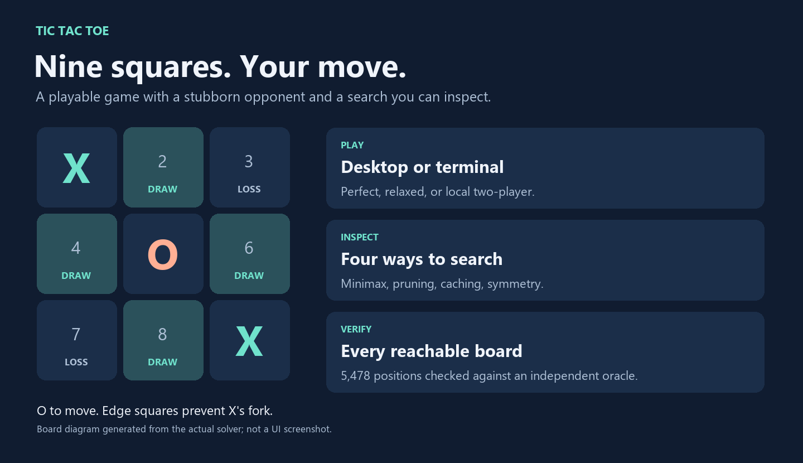
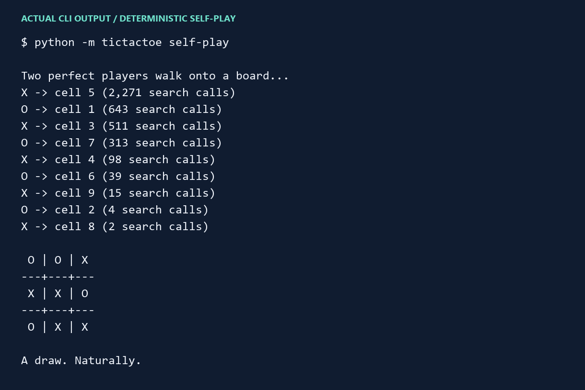
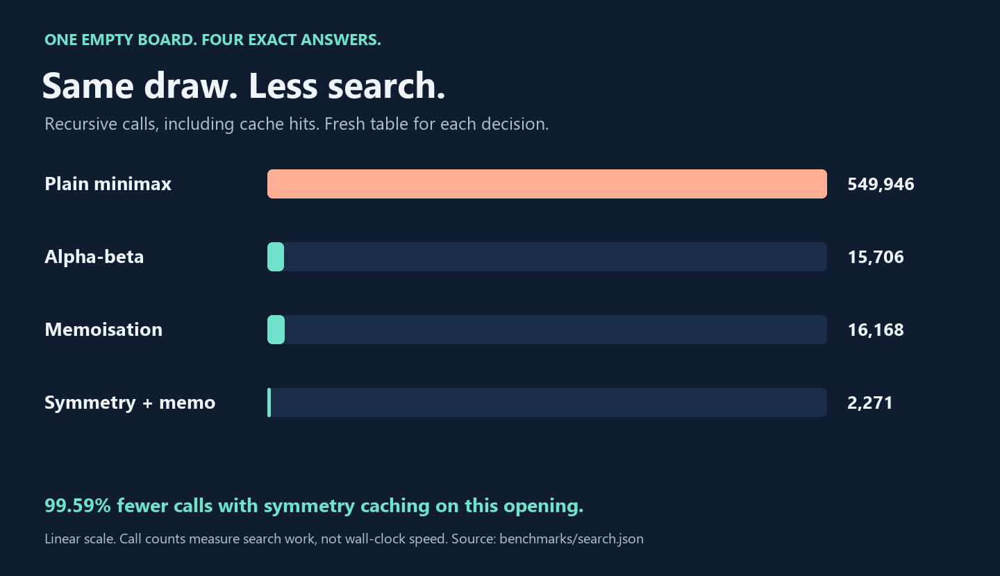
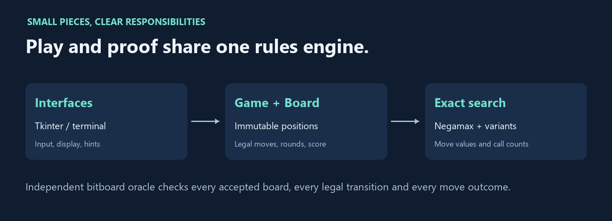

# Tic Tac Toe

**Nine squares. One stubborn opponent.**

[](https://github.com/IGoByLotsOfNames/tic-tac-toe/actions/workflows/ci.yml)


A small desktop and terminal game with a perfect opponent, a relaxed opponent, and room for a friend. Ask for a hint, inspect every possible move, or let two perfect players settle their differences. They will probably agree on a draw. In fact, the tests insist on it.



This grew from my earlier Pygame experiment with difficulty levels, scorekeeping and game-tree search. The current edition brings together immutable board rules, a separate search engine, and a test suite that checks the complete legal state space. Its perfect-play guarantees are supported by the exhaustive verification described below. [Project history and scope](docs/project-history.md).

## Play

Requires **Python 3.10 or later**. Install from this directory, preferably in a virtual environment:

```sh
git clone https://github.com/IGoByLotsOfNames/tic-tac-toe.git
cd tic-tac-toe
python -m pip install .
python -m tictactoe gui
```

The desktop game uses Tkinter. Check your Python's Tk support with `python -m tkinter`. If Tk or a graphical display is unavailable, the terminal version uses the same rules and opponent:

```sh
python -m tictactoe play
python -m tictactoe play --side O
python -m tictactoe play --mode relaxed --seed 7
python -m tictactoe play --mode local
```

| Mode | What to expect |
|---|---|
| **Perfect** | Searches to the end of the game. From an empty board, it cannot lose when it controls its side throughout. |
| **Relaxed** | Chooses a random legal square. A little room for surprises. |
| **Local two-player** | Pass the keyboard and settle it yourselves. |

X starts. Click a square or use **1–9**, numbered left to right, top to bottom. The desktop **Show a hint** button highlights all moves that preserve the best possible outcome. In the terminal, enter **h** for a hint or **q** to leave. New rounds keep the scoreboard; **Reset score** clears it. Changing modes or sides starts a fresh round.

There are no accounts, network calls, downloaded models or runtime packages to install. Tk is an optional system component; the rules, terminal game and tests are standard-library Python.

## Let the computer play itself

```sh
python -m tictactoe self-play
python -m tictactoe self-play --json
```



[Plain-text transcript](docs/self-play.txt). The image renders actual command output; it is not a desktop screenshot.

## Look behind a move

```sh
python -m tictactoe analyze X...O...X
python -m tictactoe analyze XX.OO.... --strategy alpha-beta
```

A board is nine characters in row order: `X`, `O`, or `.` for empty. Inspection returns a recommended cell, the exact outcome of **every** legal move, and search statistics. Scores are from the current player's perspective:

- **+1:** a forced win with perfect continuation.
- **0:** a draw with perfect continuation.
- **−1:** a forced loss against perfect continuation.

These are solved outcomes, not probabilities or predictions of a human's skill. An already losing position can still have a best move; the engine cannot undo earlier mistakes.

## Same answer, different amounts of work

The engine exposes four strategies so their trade-offs stay visible. All use the same deterministic move order and return exact scores for every root move. The default is symmetry-aware memoisation.

| Strategy | Opening search calls | Stored values | What changes |
|---|---:|---:|---|
| Plain minimax | 549,946 | 0 | Explore every continuation until the first win or a draw. |
| Alpha-beta | 15,706 | 0 | Stop exploring a branch once it cannot improve the result. |
| Memoisation | 16,168 | 5,477 | Reuse the exact value of a board reached by different move sequences. |
| Symmetry + memoisation | 2,271 | 764 | Also share values between rotations and reflections. |



On this opening, symmetry caching uses **99.59% fewer recursive calls** than plain minimax. This measures search work, **not a wall-clock speedup**: canonicalising a board has a cost. Tables start empty for every decision, and calls include cache hits. The root is counted but not stored. Alpha-beta and caching are intentionally separate experiments; cut-off bounds are never mistaken for exact cached values.

The [checked-in measurements](benchmarks/search.json) cover four positions and all four strategies. Reproduce all 16 results:

```sh
python tools/benchmark.py --check benchmarks/search.json
```

[How the search works, scoring conventions and complexity](docs/search.md).

## Small game, exhaustive checks

The test oracle uses **integer bitboards and X-max/O-min search**, independently of the production tuple-based negamax implementation. The suite checks:

- All **19,683** raw board encodings: exactly **5,478** positions are reachable when X starts and play stops at the first win.
- All legal transitions and all **958** terminal positions, including wins with empty squares still on the board.
- Every reachable position, **all four engines**, and the exact value of every legal candidate move against the independent oracle.
- Every human continuation against the default perfect bot from an empty board, with the bot playing either X or O: no losses.
- All eight rotations/reflections and **765** distinct symmetry classes.
- Round scoring, invalid-input handling, deterministic self-play, and a reproducible relaxed opponent.

```sh
python -m unittest discover -s tests -v
python tools/gui_smoke.py
```

The second command needs Tk and a working display. It exercises the actual desktop widgets in a withdrawn window, including cancellation of a queued computer move when a new round starts. The core tests run without a display. CI covers Python 3.10, 3.12 and 3.13 on Linux and Windows; each job also reproduces the search measurements and builds a wheel.

[Verification details and boundaries](docs/verification.md).

## Structure



```text
src/tictactoe/
  model.py       immutable board, reachability validation, legal moves
  search.py      exact negamax, pruning, memoisation, symmetry keys
  game.py        round state, scoreboard, relaxed/perfect opponents
  cli.py         terminal play, inspection, deterministic self-play
  gui.py         Tkinter interface and queued computer turns
tests/
  oracle.py      independent bitboard reference model
tools/
  benchmark.py   deterministic search measurements
  gui_smoke.py   hidden-window widget exercise
  render_docs.py diagrams and rendering of real command output
```

The scope is deliberately small: ordinary 3×3 tic-tac-toe, local play, no online matchmaking. Search optimises win/draw/loss, not the fastest win or longest resistance. Equal outcomes use a fixed centre/corner/edge order, so games and measurements are reproducible.

## Rights

Copyright © 2026 Jirapas Wongtreenatrkoon. All rights reserved, with limited permission for personal or educational local evaluation. See [LICENSE](LICENSE). This is source-available software, not an OSI-licensed open-source project.
